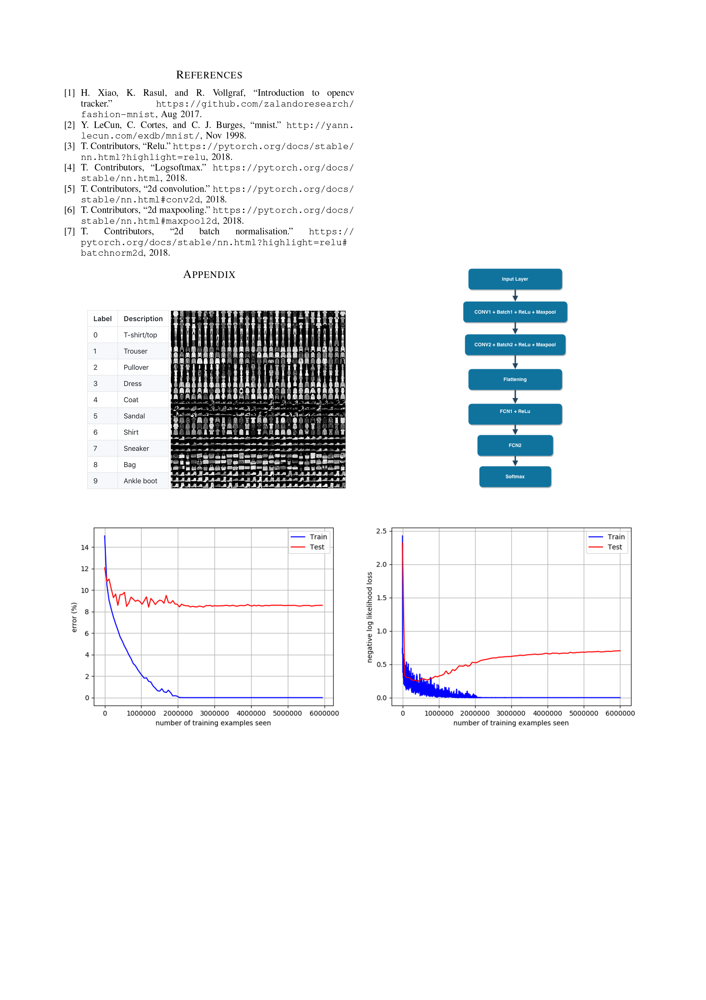

#FashionMNIST
My attempt in implementing a network for the dataset Fashion MNIST 
which can be found at: https://github.com/zalandoresearch/fashion-mnist

## Abstract
Implementation of fashion component classifica- tion using the Fashion-MNIST dataset. The dataset consists of 60k train and 10k test grayscale images of size 28X28. This work is an extension of the code provided in the first lab assignment called mnist.py; and has been implemented in Visual Studio Code Editor. The commented code along with the output, graphs representing train & test error and loss during training and Softmax probabilities for all test samples in default order in a file named predictions.txt has been submitted in a zip file as the submission of assignment P2.

## Preparation
The dataset called Fashion-MNIST[1] was used for this project. It consists of 60,000 images in the training set to train the model and 10,000 images in the test set to test the accuracy of the model. The dataset contains 10 different products(classes), each a 28X28 grayscale image; and it con- sists of images of fashion products. The dataset is provided by Zolando Research and is meant to be used as a benchmark for testing the performance of Machine Learning algorithms. The dataset did not require any cleaning, filling of missing values or transformations because it was already cleaned and optimised for use with machine learning algorithms.

## Evaluation
This work is an extension of the first lab assignment on a python file called mnist.py and new layers were added to the network to improve accuracy and the dataset was changed to Fashion-MNIST(Fig. (a)) from simple MNIST[2] that is used for identifying handwritten digits. Initially, just changing the dataset to Fashion-MNIST in mnist.py provided an accuracy of 88%. The network consisted of 2 Fully Connected Networks(FCN), 1 ReLu[3] and 1 LogSoftmax[4] transfer function on 10 epochs. The other hyperparameters used were as follows - batch size of 64, learning rate of 0.01, momentum was kept at 0.9 and log interval was 20. When a 2D Convolutional layer(CNN)[5] and 2D Maxpool[6] were added to the network the accuracy improved to 89% on 10 epochs. This network consisted of 1 CNN, 1 Maxpool, 2 ReLu, 2 FCN and 1 LogSoftmax. On adding another 2D convolutional layer to this network, the accuracy stayed at 89% for 10 epochs, but increased to 90% occasionally when the hyperparameters were tweaked a bit, especially with a higher number of epochs(20). Adding more 2D convolutional layers to the network above did not affect the accuracy of the model significantly, so 2D Batch Normalisation[7] was applied to it, which actually helped raising the accuracy to 91% while keeping the training hyperparameters constant. Further, Batch Normalisation was applied to the networkThis work is an extension of the first lab assignment on a python file called mnist.py and new layers were added to the network to improve accuracy and the dataset was changed to Fashion-MNIST(Fig. (a)) from simple MNIST[2] that is used for identifying handwritten digits. Initially, just changing the dataset to Fashion-MNIST in mnist.py provided an accuracy of 88%. The network consisted of 2 Fully Connected Networks(FCN), 1 ReLu[3] and 1 LogSoftmax[4] transfer function on 10 epochs. The other hyperparameters used were as follows - batch size of 64, learning rate of 0.01, momentum was kept at 0.9 and log interval was 20. When a 2D Convolutional layer(CNN)[5] and 2D Maxpool[6] were added to the network the accuracy improved to 89% on 10 epochs. This network consisted of 1 CNN, 1 Maxpool, 2 ReLu, 2 FCN and 1 LogSoftmax. On adding another 2D convolutional layer to this network, the accuracy stayed at 89% for 10 epochs, but increased to 90% occasionally when the hyperparameters were tweaked a bit, especially with a higher number of epochs(20). Adding more 2D convolutional layers to the network above did not affect the accuracy of the model significantly, so 2D Batch Normalisation[7] was applied to it, which actually helped raising the accuracy to 91% while keeping the training hyperparameters constant. Further, Batch Normalisation was applied to the network again to explore the possibilities of any further improvement to the accuracy of the network. Running the model with the aforementioned layers did not show any improvement in accuracy for 10 epochs, but there was an inconsistent increase in the accuracy for 20 epochs. Finally, Maxpooling was applied to the network to test for any further improve- ments, and it successfully provided an accuracy of 91% on 10 epochs, but on running 100 epochs and slightly tweaking the hyperparameters the accuracy of 92% was achieved. This later was decided to be the final network that is being submitted for evaluation, as shown in Fig. (b).

## Application
The final network model(Table (a)) that is being submitted for evaluation consists of 2 Conv2d layers, 2 BatchNorm2d layers, 2 MaxPool2d layers, 3 ReLu activation functions, 2 fc, 1 layer flattening and 1 LogSoftmax transfer function. The output consists of graphs representing train test error and loss during training and Softmax probabilities for all test samples in a file named predictions.txt. The file contains 10,000 test samples, organised in the default order. The code to achieve these output files and graphs was provided in the assignment description. Also, a file named mymodel.pt is provided which can be used to load the network model.

## Results
The final network model provides an _accuracy of 92%_ consistently with the following hyperparameters - batch size of 64, learning rate of 0.01, momentum of 0.9, log interval of 20 and 100 epochs. The output train and test error graph shows consistent error of 0% for training data and 8.5% for testing data after the first 20,00,000 training examples(Fig. (c)). Similarly, the loss graph shows a consistent loss of 0 for training data after the first 20,00,000 training examples and 0.7 for the testing data after the first 40,00,000 training examples(Fig. (d)).

## Appendix

